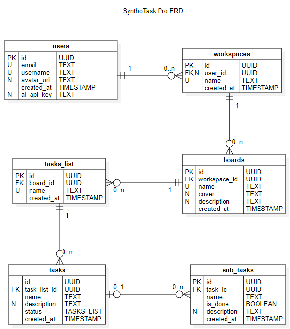

# SynthoTask Pro Documentation

In this repository, you will find all the documentation for the SynthoTask Pro project. The project is a web application that allows users to create and manage tasks and projects.

### ERD Diagram:

The diagram is a visual representation of the database schema for the project. The diagram was created using [StartUML](https://staruml.io/).

